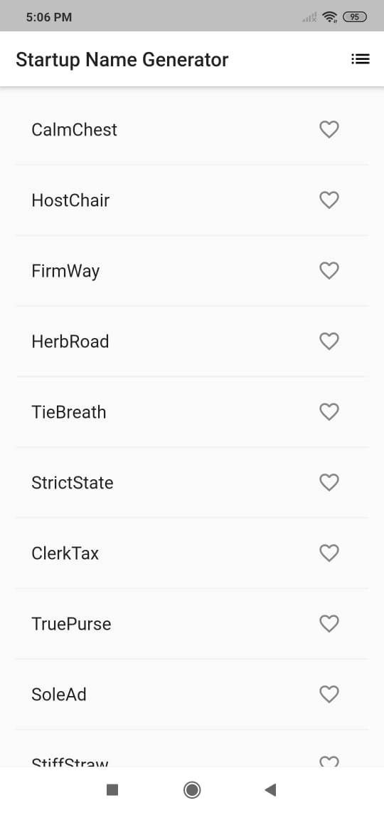
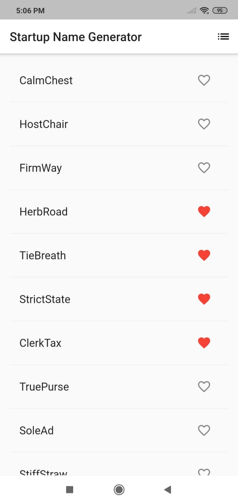
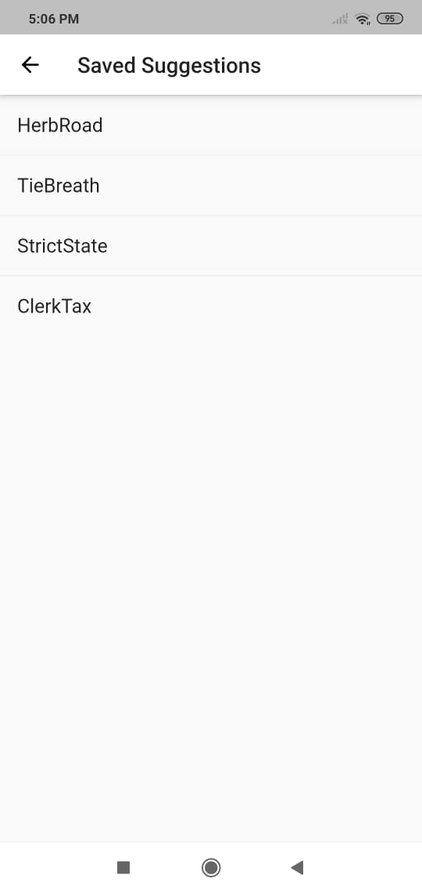

# VD_flutter_training_5

## Persistant storage demonstration app

This app demonstrates storage options in Flutter application
1. SharedPreferences
2. SQLite

# Screenshots

## Random Words loaded

## Some added to favorite list

## See the favorites list directly from storage


### Initializing SharedPreference object
```dart
SharedPreferences prefs = await SharedPreferences.getInstance();
```
### Saving a list of strings in SharedPreferences
```dart
prefs.setStringList('[key_name]', _saved);
```
### Fetching the list of strings from SharedPreferences
```dart
prefs.getStringList('[key_name]');
```

